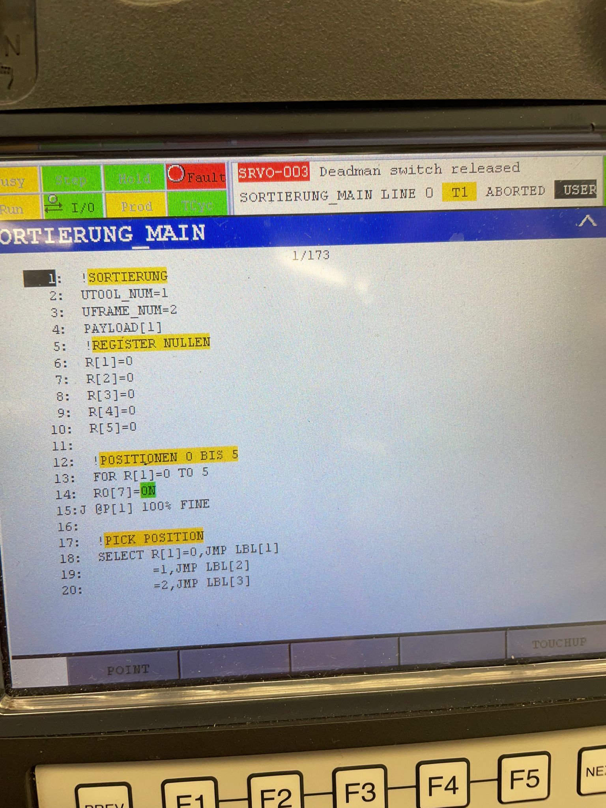
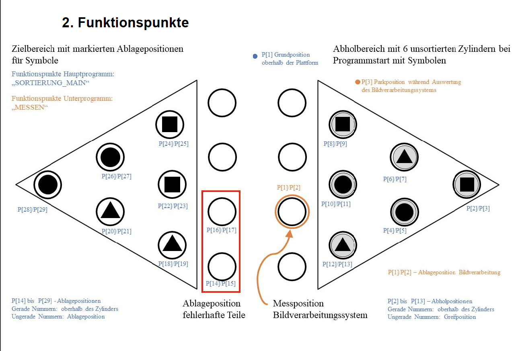
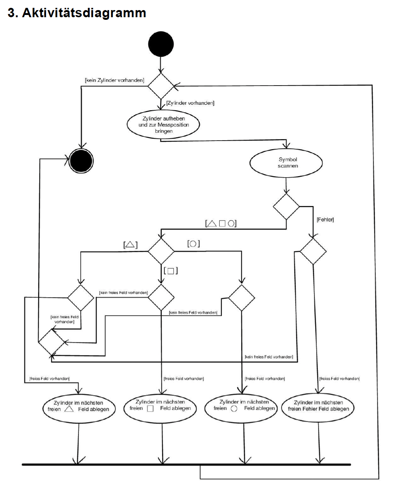

# 📦 Sortieralgorithmus für Zylinder

Ein Projekt zur Implementierung eines Sortieralgorithmus für Industrieroboter. Ziel ist die Erkennung und Sortierung von Zylindern anhand von Symbolen wie Dreieck, Quadrat und Kreis. 

---

## 🌟 **Projektübersicht**

Dieses Projekt zeigt die Fähigkeit, komplexe Logiken mithilfe eines Teach-Pendants zu realisieren. Es umfasst:
- **Symbolbasierte Sortierung** von Zylindern.
- **Teach-Pendant Code**: Implementierung eines Hauptprogramms und eines Unterprogramms.
- **Hardware**: Steuerung des Roboters über ein Ramps 1.4 Shield Board.
- **Ablaufvisualisierung**: Funktionspunkte und Aktivitätsdiagramme, um die Sortierlogik verständlich darzustellen.

---

## ⚙️ **Funktionsweise des Sortieralgorithmus**

### **1. Initialisierung**
- Der Algorithmus setzt wichtige Parameter:
  - `UTOOL_NUM = 1`: Das Werkzeug des Roboters wird definiert.
  - `UFRAME_NUM = 2`: Der Referenzrahmen wird festgelegt.
- **Alle Register (R[1] bis R[5]) werden auf 0 gesetzt**, um eine neutrale Ausgangslage zu schaffen.

---

### **2. Abholung der Zylinder (Pick Position)**
- Über eine `SELECT`-Anweisung wird der aktuelle Zustand eines Registers überprüft.
- Anhand des Zustands wird zu einer markierten Stelle (`LBL[x]`) im Programm gesprungen:
  - **LBL[1] - Position P[2]**
  - **LBL[2] - Position P[4]**
  - **LBL[3] - Position P[6]**
  - **LBL[4] - Position P[8]**
  - **LBL[5] - Position P[10]**
  - **LBL[6] - Position P[12]**
- Der Greifer wird zu der jeweiligen Position geführt, der Zylinder wird gegriffen und zur Ausgangsposition zurückgebracht.

---

### **3. Symbolerkennung**
- Nach dem Platzieren wird das **Unterprogramm `MESSEN`** aufgerufen.
- Das Symbol des Zylinders wird mithilfe eines Vision-Systems identifiziert und das Ergebnis im Register `R[20]` gespeichert:
  - **R[20] = 0**: Fehlerhaftes Symbol
  - **R[20] = 1**: Dreieck
  - **R[20] = 2**: Quadrat
  - **R[20] = 3**: Kreis

---

### **4. Platzierung der Zylinder**
Basierend auf dem Wert in `R[20]` wird der Zylinder in den korrekten Zielbereich gelegt:
- **Fehlerhafte Zylinder**: Ablage in einem speziellen Bereich (z. B. Position P[14]).
- **Dreieck**: Ablage an den nächsten freien Feldern für Dreiecke.
- **Quadrat**: Ablage an den nächsten freien Feldern für Quadrate.
- **Kreis**: Ablage an den nächsten freien Feldern für Kreise.

---

### **5. Schleifenabschluss**
- Die Schleife endet, wenn alle Zylinder sortiert und korrekt platziert wurden.

---
## Diagramme und Bilder

### Teach-Pendant Code Beispiel


### Funktionspunkte
Dieses Diagramm zeigt die Ziel- und Abholpositionen der Zylinder.


### Aktivitätsdiagramm
Das Aktivitätsdiagramm visualisiert die Logik des Sortierprozesses.


---

## 🖥️ **Code-Struktur**

### **Hauptprogramm: `Sortierung_Main`**
Das Hauptprogramm steuert den Ablauf der Sortierung:
```plaintext
1. UTOOL_NUM = 1
2. UFRAME_NUM = 2
3. R[1] bis R[5] = 0 (Initialisierung)
4. SELECT R[1] → Springt zu den entsprechenden Labels (LBL[1] bis LBL[6]).
5. Aufruf des Unterprogramms `MESSEN`.
6. Ablage basierend auf dem Symbolwert in R[20].
```

### Unterprogramm: `Messen`**
```plaintext
1. Bewegung zur Messposition.
2. Aktivierung des Vision-Systems.
3. Ergebnis in Register R[20] speichern.
```
